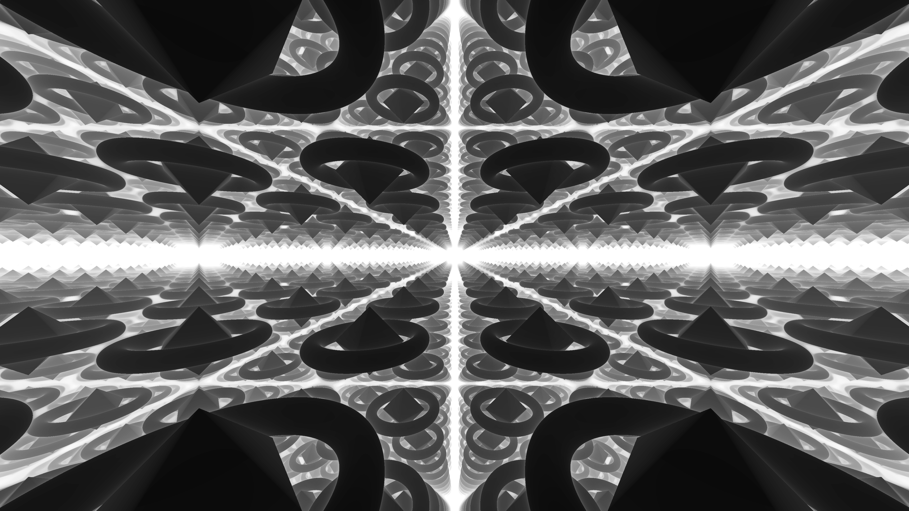
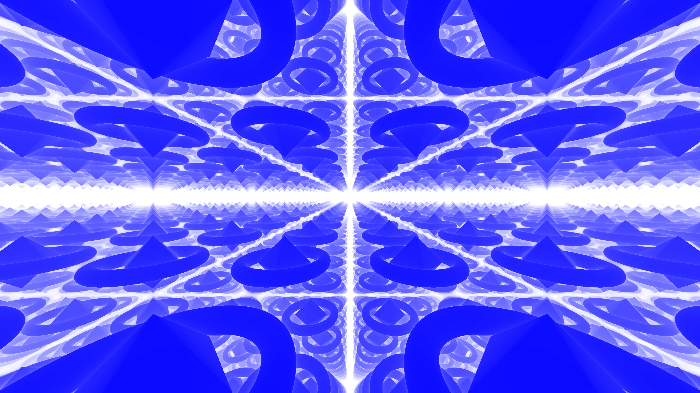
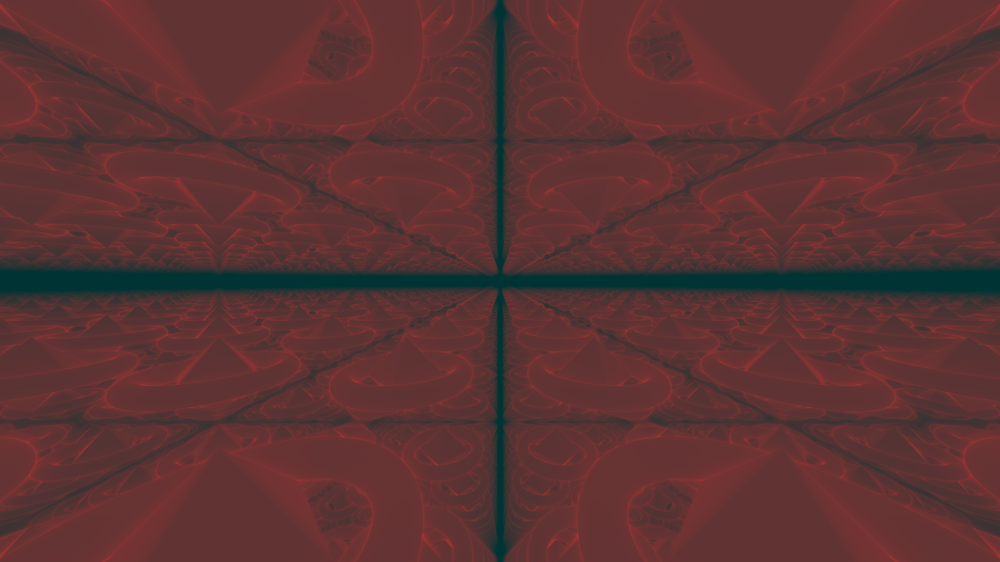

# Shadertoy animation project

[Project Link](https://www.shadertoy.com/view/lfVyW3)

At first I tried to do The Art of Code's Over the Moon
video tutorial, and then I did kishimisu's
videos about shader art coding and raymarching.
I found raymarking and his fractal-like animation to be very interesting, so from the videos I made my own raymarcher animation.

As my base object to be tiled, I made three toruses,
one of which rotated about the x-axis and the other
about the z-axis. I placed an octahedron in the center 
to make the object more interesting.


I then used space reptition with the fract() function.
Then I experiemented with what  sorts of effects looked the most interesting.
I still used spiral rays and mouse camera movement
like shown in kishimisu's videos.
To make each column of objects move in opposite directions,
I used the floor() function on the x-coordinate to determine
whether it should move forwards or backwards.

Most of my time was spent on trying to achieve interesting
colors for my animation. At the bottom of the code
there are multiple commented out color functions 
that each give interesting color schemes(please try them out!). Using the step count adds depth and texture to the shapes. I realized that tan and the reciprocal function
were useful for created sharp and trippy color schemes
due to their asymptotes.

Tangent with reprocal makes sharp, trippy colors:
```c
col = tan(0.4/palette(t*.3 + float(i)*0.05));
col = tan(0.4/palette(t*.3 + float(i)*0.5));
col = tan(vec3(1.0) - 0.5/palette(t*.3 + float(i)*.05));
col = tan(0.4/palette(t*.3));
```


Solid colors:
```c
col = vec3(t*.04+ float(i)*.005);
col = vec3(t*.04+ float(i)*.005, t*.04+ float(i)*.005,1.0);
```


Subtraction from a constant value is useful for creating a glowing red color:
``` c
col = vec3(0.4-t*.04+ float(i)*.005, 0.2, 0.2);
```

